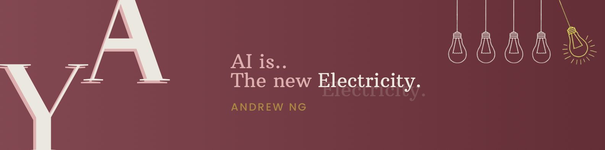

  

## Hi, I'm Yousra Tamer 👋
---

## About Me:-
* <h4> Dedicated AI student passionate about building scalable, reliable, and maintainable intelligent systems. 
* <h4> Currently interested in Prompt Engineering, AI Agents and Automation.
* <h4> A lifelong learner with a strong focus on mastery and innovation.
* <h4> I always seek to apply what I learn by bridging the gap between theory and practice, and I look forward to being a transformative addition wherever I work.

--- 

## Tech Stack:-

#### 💻 Programming Languages

  

#### 🤖 AI & Machine Learning Tools

  

#### 💾 Backend & Databases

  

